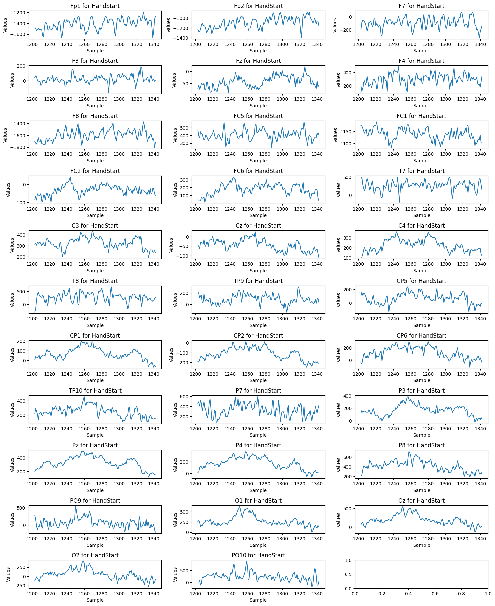

# EEG Analysis Pipeline for Grasp and Lift Hand Movements Prediction

Welcome to the EEG Analysis Pipeline repository, dedicated to predicting grasp and lift hand movements using multi-channel EEG recordings. This project explores a rich dataset sourced from the study conducted by Luciw MD, Jarocka E, and Edin BB in 2014, encompassing a staggering 3,936 grasp and lift trials. The trials vary in weight and friction, making the dataset a valuable resource for understanding the intricacies of neural activity associated with hand movements.

## Dataset Source

The dataset used in this analysis is based on the research article titled ["Multi-channel EEG recordings during 3,936 grasp and lift trials with varying weight and friction"](https://www.nature.com/articles/sdata201447) published in Scientific Data, 2014. The data was generously made available to the research community by the authors for scientific exploration and analysis.

You can access the dataset and participate in related competitions on Kaggle. The dataset is available for download at the following Kaggle competition page: [Grasp and Lift EEG Detection](https://www.kaggle.com/competitions/grasp-and-lift-eeg-detection/overview).

## Overview

This repository contains an in-depth analysis of the EEG data, exploring neural patterns associated with specific hand movements. The dataset comprises recordings from 12 subjects, each undergoing 10 series of trials, with around 30 trials in each series. Notably, the number of trials within each series varies, adding a layer of complexity to the analysis.

## Event Detection and Data Exploration

Our analysis focuses on detecting six key events related to grasp and lift hand movements. These events occur in a specific order:

1. **HandStart**
2. **FirstDigitTouch**
3. **BothStartLoadPhase**
4. **LiftOff**
5. **Replace**
6. **BothReleased**

In addition to event detection, our pipeline includes comprehensive data exploration. Functions have been developed to graph each channel in a compound graph, providing preliminary insights.

  

Furthermore, a surface graph is generated, visualizing all channels together for holistic exploration of neural activity patterns.

## Classification with Random Forest

The analysis employs a Random Forest classifier. The classification report provides detailed metrics for each event class, including precision, recall, and F1-score. Moreover, the pipeline identifies the top 10 important features contributing to the classification. Additionally, a specialized function is implemented to predict the top features per class for a more granular understanding of neural activity patterns associated with each event.

### Global Classification with RF

**Accuracy:** 0.86

|                | Precision | Recall | F1-Score | Support |
|----------------|-----------|--------|----------|---------|
| **HandStart**            | 0.99      | 0.19   | 0.31     | 1547    |
| **FirstDigitTouch**       | 1.00      | 0.09   | 0.16     | 1521    |
| **BothStartLoadPhase**    | 1.00      | 0.08   | 0.15     | 1541    |
| **LiftOff**              | 0.98      | 0.13   | 0.22     | 1451    |
| **Replace**              | 0.99      | 0.11   | 0.19     | 1520    |
| **BothReleased**         | 0.99      | 0.13   | 0.22     | 1562    |
| **Micro Avg**            | 0.99      | 0.12   | 0.21     | 9142    |
| **Macro Avg**            | 0.99      | 0.12   | 0.21     | 9142    |
| **Weighted Avg**         | 0.99      | 0.12   | 0.21     | 9142    |
| **Samples Avg**          | 0.02      | 0.02   | 0.02     | 9142    |

### Global Feature Importance

| Feature | Importance |
|---------|------------|
| F8      | 0.049340   |
| Fp1     | 0.044739   |
| Fp2     | 0.042284   |
| FC1     | 0.040208   |
| TP10    | 0.039865   |
| FC6     | 0.038916   |
| F7      | 0.036478   |
| Cz      | 0.035935   |
| FC2     | 0.035217   |
| CP1     | 0.034244   |

### Feature Importance per Class

| **Class: HandStart**             | **Class: FirstDigitTouch**      | **Class: BothStartLoadPhase**  | **Class: LiftOff**             | **Class: Replace**             | **Class: BothReleased**        |
|---------------------------------|---------------------------------|---------------------------------|---------------------------------|---------------------------------|---------------------------------|
| F8 - Frontal (R)                | F8 - Frontal (R)                | F8 - Frontal (R)                | F8 - Frontal (R)                | Fp1 - Frontal (L)               | Fp1 - Frontal (L)               |
| Cz - Central                    | FC6 - Frontocentral (R)         | Fp2 - Frontal (R)               | TP10 - Temporal (R)             | Fp2 - Frontal (R)               | F8 - Frontal (R)                |
| Fp2 - Frontopolar (R)           | Fp2 - Frontopolar (R)           | Fp1 - Frontopolar (L)          | FC6 - Frontocentral (R)         | F8 - Frontal (R)                | Fp2 - Frontopolar (R)          |
| Fp1 - Frontopolar (L)           | Fp1 - Frontopolar (L)           | FC1 - Frontocentral (L)         | Fp2 - Frontopolar (R)          | TP10 - Temporal (R)             | FC1 - Frontocentral (L)         |
| FC1 - Frontocentral (L)         | FC1 - Frontocentral (L)         | F7 - Frontal (L)                | FC1 - Frontocentral (L)         | Cz - Central                    | TP10 - Temporal (R)             |
| CP2 - Centroparietal (R)        | F7 - Frontal (L)                | TP10 - Temporal (R)            | Fp1 - Frontopolar (L)          | Fz - Frontal                    | Fz - Frontal                    |
| FC6 - Frontocentral (R)         | TP10 - Temporal (R)            | CP1 - Centroparietal (L)       | Fp1 - Frontopolar (L)          | F7 - Frontal (L)                | F7 - Frontal (L)                |
| P3 - Parietal (L)               | CP1 - Centroparietal (L)       | CP5 - Centroparietal (L)       | F7 - Frontal (L)                | FC2 - Frontocentral (R)         | FC2 - Frontocentral (R)         |
| CP1 - Centroparietal (L)        | CP2 - Centroparietal (R)       | FC2 - Frontocentral (R)        | T7 - Temporal (L)               | FC6 - Frontocentral (R)         | FC6 - Frontocentral (R)         |
| CP5 - Centroparietal (L)        | FC2 - Frontocentral (R)        |                                 | CP2 - Centroparietal (R)        |                                 | TP9 - Temporal (L)              |

Feel free to explore the Jupyter Notebooks in the `Notebook/` directory for a step-by-step walkthrough of the analysis pipeline. 

We encourage you to use this repository as a resource for learning, research, and experimentation in the field of EEG analysis.
